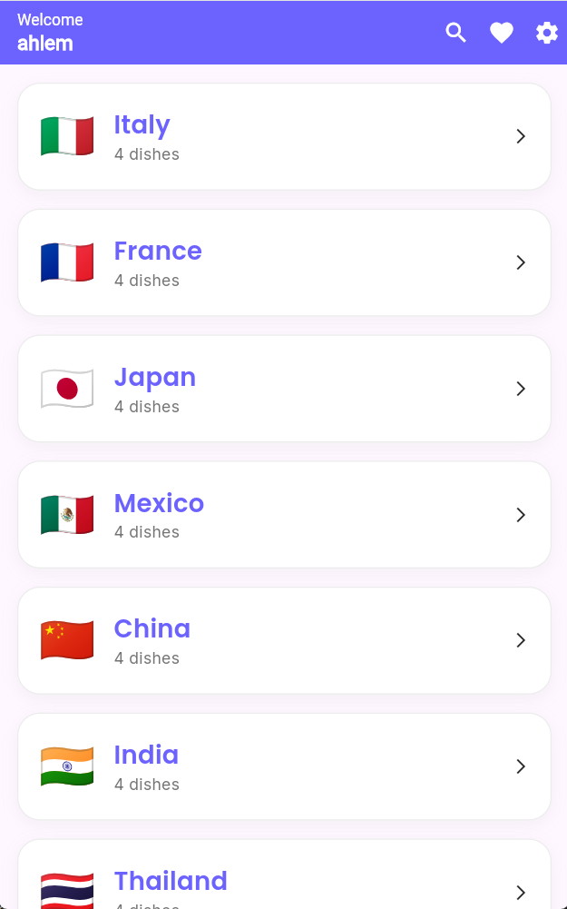
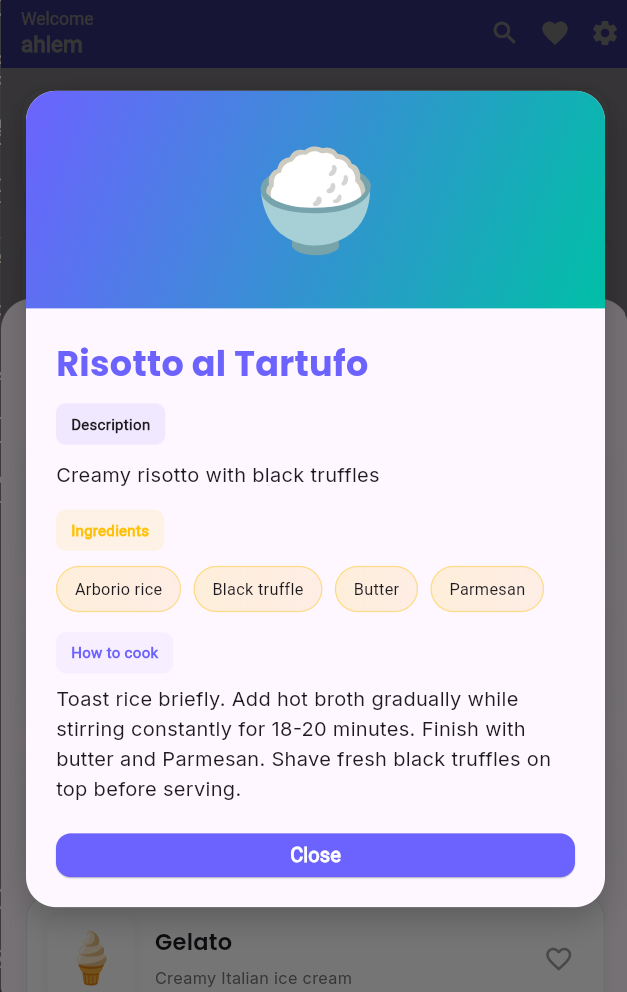
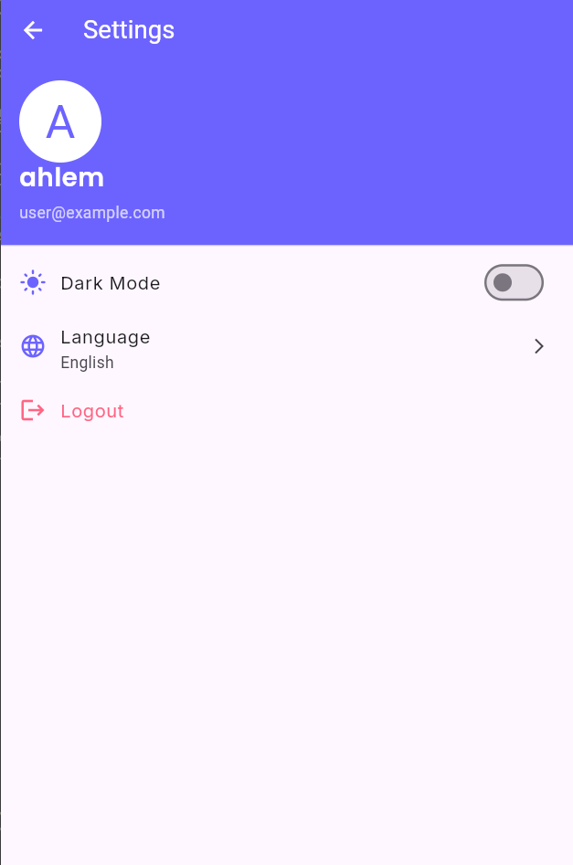

# Culinary World

## A. Author
- **Name:** Ahlem Ajra
- **Matricola:** 345323

## B. Project Title
- **Title:** Culinary World - Explore Countries & Their Cuisines

## C. Overview
Culinary World is a Flutter mobile application that showcases countries around the globe with their unique cuisines and cultural highlights. Users can browse a comprehensive list of countries, explore detailed information about each country, save their favorite destinations, and manage personalized preferences. The app features multi-language support (English & French), dark/light theme options, user authentication with login/signup, and persistent local storage for favorites and user data.

## D. User Experience

1. **Login:** Start by logging in with your credentials or sign up for a new account.
   

2. **Browse Countries:** View the main screen with a list of countries. Each shows the flag and name.
   

3. **Explore Details:** Tap on a country to see detailed information, cuisine highlights, and what it's famous for.
   

4. **Save Favorites:** Add countries to your favorites list for quick access.
   

5. **Customize:** Visit Settings to change language (English/French) and theme (light/dark).
   

## E. Technology & Implementation Notes
- **Flutter & Dart:** Built with Flutter (stable) and Dart for cross-platform UI.
- **Packages:** Uses Flutter core widgets; add packages in `pubspec.yaml` as needed (e.g., `provider` for state management, `http` for networking). Picked lightweight solutions to keep app simple and focused on UI/UX.
- **Implementation choices:** The app favors composition and small widgets for testability. Navigation uses Flutter's `Navigator` and named routes for clarity.
- **Data & networking:** This example stores data in memory; if remote storage or APIs are required, `http` or `dio` can be used and local caching (e.g., `shared_preferences` or `hive`) added.
- **Issues encountered:** Common Flutter layout/overflow issues were handled using flexible layouts (`Expanded`, `Flexible`) and scrollable widgets (`ListView`, `SingleChildScrollView`). If you ran into build or asset problems, ensure `pubspec.yaml` includes the `assets/` path and run `flutter pub get`.

